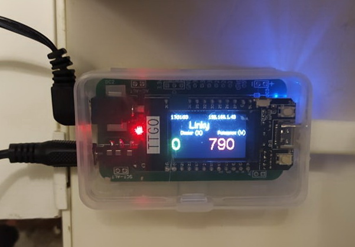

# PV Router ESP32 / TTGO T-Display — Fronius Zero Grid + RobotDyn

🇫🇷 **Français — ce fichier** | 🇬🇧 **[English documentation](./README_EN.md)**

Routeur de surplus photovoltaïque pour **ESP32 / TTGO T-Display**, basé sur la mesure temps réel d'un **Fronius + Smart Meter** et le pilotage HTTP d'un **dimmer Wi-Fi RobotDyn** alimentant un chauffe-eau résistif.

L'objectif est d'utiliser localement le surplus PV tout en restant au plus près de zéro au point de livraison, avec un léger biais volontaire vers l'export afin de limiter les micro-imports lors des variations rapides de charge ou de production.

> **Firmware PV Router : V14.8**  
> **Algorithme de régulation Zero Grid : V14.3**  
> **Interface Fronius : Solar API v1**  
> **Endpoint Fronius : `/solar_api/v1/GetPowerFlowRealtimeData.fcgi`**  
> **Dimmer RobotDyn testé : firmware `Version 20260514`**



---

## Origine, crédits et remerciements

Ce projet est une **adaptation et une évolution du PV Router ESP32 de Xlyric** :

- projet amont : https://github.com/xlyric/pv-router-esp32
- auteur / mainteneur amont : **Xlyric**
- communauté associée au projet d'origine : **APPER**

Un grand merci à **Xlyric** pour avoir publié et maintenu ce travail en open source, ainsi qu'aux contributeurs de la communauté APPER. Ce dépôt n'aurait pas existé sous cette forme sans cette base.

Le dimmer Wi-Fi utilisé par cette branche est également basé sur le projet du même auteur :

- **PV-discharge-Dimmer-AC-Dimmer-KIT-Robotdyn** : https://github.com/xlyric/PV-discharge-Dimmer-AC-Dimmer-KIT-Robotdyn

Le matériel utilisé ici est un **RobotDyn / D1 mini** piloté en HTTP. Le firmware RobotDyn validé avec cette branche est `Version 20260514`.

Cette adaptation diverge volontairement du routeur d'origine sur plusieurs points importants : la **source de vérité de la régulation est le Fronius Smart Meter via Fronius Solar API v1**, la boucle active n'utilise plus le SCT013 comme mesure principale, la régulation Zero Grid est prédictive, et l'interface Web / l'affichage TTGO ont été largement retravaillés.

> Ce dépôt est une adaptation personnelle du projet amont ; il ne doit pas être présenté comme une version officielle publiée par Xlyric ou par l'association APPER.

---

# 1. Architecture

```text
                         réseau 230 V
                              ^
                              |
Fronius + Smart Meter         |
        |                     |
        | Solar API v1        |
        | HTTP / PowerFlow    |
        v                     |
     ESP32 / TTGO             |
        |                     |
        | Zero Grid V14.3     |
        | HTTP POWER=0..100   |
        v                     |
 RobotDyn Wi-Fi Dimmer -------+
        |
        v
 chauffe-eau / résistance
```

La **boucle de régulation ne dépend ni de MQTT ni de Home Assistant**. Le chemin critique est uniquement :

```text
Fronius -> ESP32 -> RobotDyn
```

MQTT, Home Assistant, le dashboard Web et l'écran sont des couches de télémétrie / interface.

---

# 2. Matériel de référence

Configuration testée :

- ESP32 **TTGO T-Display** 240 × 135, ST7789 ;
- onduleur **Fronius Primo 6.0-1** ;
- **Fronius Smart Meter TS 65A-1** ;
- dimmer Wi-Fi **RobotDyn / D1 mini** ;
- firmware RobotDyn testé : `Version 20260514` ;
- triac BTA16 sur le montage de référence actuel ;
- sonde Dallas / DS18B20 côté RobotDyn pour la température ECS ;
- chauffe-eau résistif calibré dans le PV Router à **800 W** ;
- MQTT / Home Assistant facultatifs.

Le dépôt contient encore des éléments hérités de l'ancienne mesure locale par transformateur de courant, mais cette branche est conçue et maintenue autour de la **mesure Fronius Solar API v1**.

---

# 3. Fronius : source de vérité du Zero Grid

Le firmware interroge directement :

```text
GET http://<IP_FRONIUS>/solar_api/v1/GetPowerFlowRealtimeData.fcgi
```

Une mesure n'est acceptée que si :

- HTTP retourne 200 ;
- le JSON est valide ;
- `Head.Status.Code == 0` ;
- `Body.Data.Site.P_Grid` existe ;
- `P_Grid` est fini et reste dans une plage cohérente.

La production PV est lue dans `Body.Data.Site.P_PV`, avec repli éventuel sur `Body.Data.Inverters.1.P`.

### Convention de signe

```text
P_Grid > 0  = import depuis le réseau
P_Grid < 0  = export vers le réseau
```

### Cadence Fronius adaptative — V14.7+

En journée, la régulation reste rapide. Lorsqu'un Fronius est indisponible longtemps, typiquement la nuit, les requêtes sont espacées pour réduire l'activité CPU / Wi-Fi du TTGO :

```text
Fronius ONLINE            : 1,5 s
OFFLINE depuis < 2 min    : 5 s
OFFLINE depuis 2 à 10 min : 15 s
OFFLINE depuis > 10 min   : 30 s
Timeout HTTP              : 700 ms
Donnée stale régulation   : 4 s
```

Dès qu'une réponse Fronius valide revient, la cadence normale de **1,5 s** est restaurée immédiatement.

Chaque mesure Fronius validée incrémente un compteur d'échantillon. La régulation ne prend qu'une décision par nouvel échantillon validé.

---

# 4. Régulation Zero Grid V14.3

Réglages par défaut :

```text
Puissance résistance        : 800 W
Dimmer maximum              : 100 %
Cible réseau                : -15 W
Bande morte                 : ±10 W
Bande cible effective       : -25 W à -5 W
```

Une légère exportation est donc volontairement conservée.

Ces valeurs sont stockées dans `config.json` et sont configurables depuis Web V2 :

```json
{
  "heater_power_w": 800,
  "grid_target_w": -15,
  "grid_deadband_w": 10,
  "dimmer_max_percent": 100
}
```

Principe physique :

```text
Pheater_cible = Pheater_actuel + (Pcible_reseau - Pgrid_actuel)
```

Exemple avec une résistance de 800 W :

```text
Dimmer réel       : 50 %  -> ~400 W
P_Grid            : -200 W
Cible réseau      : -15 W
Correction        : +185 W
Puissance CE cible: ~585 W
Dimmer cible      : ~73 %
```

V14.3 ne repose plus sur des rampes arbitraires de montée. La baisse de puissance reste libre afin de délester rapidement si une charge importante démarre dans la maison.

Seuils internes actuels :

```text
Import rapide      : 80 W
Import urgence     : 250 W
Réserve rapide     : 25 W
Réserve urgence    : 50 W
```

---

# 5. RobotDyn

## Commande de puissance

Le PV Router envoie une consigne absolue :

```text
GET http://<IP_DIMMER>/?POWER=<0..100>
```

Avec une résistance calibrée à 800 W :

```text
1 %   ~= 8 W
50 %  ~= 400 W
100 % ~= 800 W
```

## État et température

```text
GET http://<IP_DIMMER>/state
GET http://<IP_DIMMER>/config
```

Le PV Router lit notamment `dimmer`, `commande`, `dallas0`, `temperature`, `RSSI`, `version`, `onoff`, `alerte`, `maxtemp` et `trigger`.

`dallas0` est utilisé en priorité pour la température ECS.

Cadence normale :

```text
/state désynchronisé : ~2 s
/state synchronisé   : ~5 s
/config              : 30 s
Timeout HTTP         : 500 ms
Keepalive commande   : 60 s
```

Après **10 minutes de Fronius hors ligne**, le mode éco RobotDyn s'active :

```text
/state  : 30 s
/config : 5 min
```

Tant que `/config` n'a jamais été lu correctement, le retry reste à 10 s afin de ne pas dégrader la sécurité thermique.

## Tmax et trigger

Le firmware RobotDyn testé applique en arithmétique entière :

```text
reprise = maxtemp - ((maxtemp * trigger) / 100)
```

Exemple :

```text
maxtemp = 56 °C
trigger = 3 %
(56 * 3) / 100 = 1
reprise = 55 °C
```

Le PV Router reproduit exactement cette formule. Une fois `TEMP MAX` atteint, la chauffe reste bloquée (`TEMP HOLD`) jusqu'à la température de reprise.

Si `/config` est indisponible, un repli conservateur de 2 °C est utilisé temporairement.

---

# 6. Sécurités / fail-safe

Le PV Router demande `POWER=0` si :

- Fronius est inaccessible ou la donnée devient stale ;
- `autonome=false` ;
- RobotDyn remonte `onoff=false` ;
- une alarme RobotDyn non thermique est active ;
- la protection thermique ECS locale est active.

MQTT et Home Assistant ne font pas partie de cette chaîne de sécurité.

---

# 7. Première configuration Wi-Fi

Le mode de configuration Wi-Fi est déclenché **physiquement** et n'apparaît jamais simplement parce que la box est en panne.

## Entrer dans le mode setup

1. couper l'alimentation du PV Router ;
2. maintenir le bouton utilisateur TTGO (`GPIO35`) ;
3. remettre l'alimentation en gardant le bouton appuyé ;
4. maintenir environ **3 secondes** ;
5. relâcher lorsque l'écran affiche `MODE CONFIG WIFI`.

Connexion au portail :

```text
SSID         : PVRouter-Setup
Mot de passe : pvrouter14
Adresse      : http://192.168.4.1
```

Après **Enregistrer et redémarrer**, les identifiants sont stockés dans `/wifi.json` puis l'ESP32 redémarre.

Priorité des identifiants :

```text
1. /wifi.json si un vrai SSID est enregistré
2. WIFI_NETWORK / WIFI_PASSWORD de config.h en secours
```

Si le réseau domestique reste indisponible pendant `WIFI_TIMEOUT`, le boot continue en mode hors ligne et les reconnexions se font en arrière-plan. Le point d'accès de maintenance n'est jamais ouvert automatiquement.

Guides dédiés :

- [Première configuration Wi-Fi — français](./docs/WIFI_SETUP_FR.md)
- [First Wi-Fi setup — English](./docs/WIFI_SETUP_EN.md)

---

# 8. Écran TTGO

Le dashboard principal affiche : heure, température ECS/Tmax, état CE, grand bandeau `IMPORT` / `ZERO GRID` / `DISPO` / `SURPLUS`, PV, réseau, chauffe-eau, maison et jauge de puissance.

Le rendu est **différentiel** afin de réduire le scintillement du ST7789.

Appuis en fonctionnement normal :

```text
Appui court : écran principal -> diagnostic -> aide -> principal
Appui long  : écran OFF
```

La page diagnostic affiche notamment :

```text
WiFi  <RSSI>  <SSID>
IP
Fronius
Dimmer
CE link
Eau/Tmax
Uptime
```

Le SSID utilise la même police / taille que la ligne Wi-Fi et reste mémorisé pour éviter les disparitions ponctuelles lors des rafraîchissements.

Après environ 10 minutes de Fronius hors ligne, le rétroéclairage est automatiquement coupé. Un appui sur le bouton permet toujours de réveiller temporairement l'écran.

---

# 9. Interface Web V2

Dashboard :

```text
http://<IP_DU_ROUTEUR>/
```

Configuration :

```text
http://<IP_DU_ROUTEUR>/config.html
```

Le dashboard fournit notamment :

- PV / réseau / maison / chauffe-eau ;
- Fronius / RobotDyn / MQTT ;
- température ECS / Tmax / trigger / reprise ;
- cible Zero Grid, bande, correction, CMD / ACTUAL ;
- historique navigateur d'environ 30 min ;
- diagnostic copiable ;
- mémoire libre et uptime ;
- aide de lecture de l'écran TTGO.

Paramètres actuellement éditables depuis Web V2 :

```text
Adresse IP RobotDyn
Timeout écran
Tmax ECS de secours
Puissance réelle de la résistance
Cible réseau
Bande morte
Limite maximale du dimmer
```

API locale :

```text
GET  /api/status
GET  /api/config
POST /api/config
GET  /api/config/export
POST /api/config/import
POST /api/screen/toggle
POST /api/restart
```

`/api/status` expose notamment :

```text
firmware_version       = V14.8
fronius_api            = Solar API v1
fronius_powerflow_path = /solar_api/v1/GetPowerFlowRealtimeData.fcgi
regulation.version     = V14.3
```

### Icône Web / favicon — V14.8

V14.8 ajoute une identité visuelle PV Router directement embarquée dans le firmware. Le navigateur peut récupérer :

```text
/favicon.svg
/favicon.ico
```

Le favicon est donc disponible sans `uploadfs` et apparaît dans l'onglet / la barre d'adresse selon le navigateur. Les favicons étant fortement mis en cache, un rechargement forcé ou la réouverture de l'onglet peut être nécessaire après mise à jour.

---

# 10. MQTT / Home Assistant

Topic principal :

```text
pvrouter/state
```

Disponibilité :

```text
pvrouter/availability
```

La boucle Zero Grid ne dépend pas de MQTT. Home Assistant Discovery est disponible si `HA_ENABLED` est activé.

---

# 11. Installation / HOW TO

## Récupérer le dépôt

```bash
git clone <URL_DU_DEPOT>
cd pv-router-esp32-v2025
git checkout feature/fronius-zero-grid-v13-dimmer-20260514
```

Le projet utilise **PlatformIO**.

## Créer `src/config/config.h`

```bash
cp src/config/config.example.h src/config/config.h
```

À renseigner au minimum :

```cpp
#define WIFI_NETWORK "MON_WIFI_DE_SECOURS"
#define WIFI_PASSWORD "MON_MOT_DE_PASSE_DE_SECOURS"

#define IP_FRONIUS "192.168.x.x"

#define MQTT_SERVER "192.168.x.x"
#define MQTT_PORT 1883
#define MQTT_USER "mon_user"
#define MQTT_PASSWORD "mon_password"
```

Les identifiants Wi-Fi compilés sont des **valeurs de secours** : un `/wifi.json` valide est prioritaire.

Pour désactiver MQTT :

```cpp
#define MQTT_CLIENT false
```

## Préparer SPIFFS

Pour une première installation complète :

```bash
cp data/config.json.ori data/config.json
cp data/wifi.json.ori data/wifi.json
```

Dans `config.json`, vérifier au minimum :

```json
{
  "autonome": false,
  "dimmer": "192.168.x.x",
  "tmax": 65,
  "screentime": 0,
  "heater_power_w": 800,
  "grid_target_w": -15,
  "grid_deadband_w": 10,
  "dimmer_max_percent": 100
}
```

`autonome=false` est recommandé lors du premier flash. Ne passer à `true` qu'après validation du Fronius et du RobotDyn.

## Compiler et flasher

```bash
pio run
pio run -t upload
pio device monitor -b 115200
```

Pour charger l'interface Web / SPIFFS :

```bash
pio run -t uploadfs
```

### Attention à `uploadfs`

`uploadfs` remplace le filesystem SPIFFS et peut écraser `config.json` **et `wifi.json`**.

Avant un nouvel `uploadfs`, exporter le vrai fichier de configuration complet :

```bash
curl --connect-timeout 5 http://<IP_DU_ROUTEUR>/api/config/export -o data/config.json
pio run -t uploadfs
rm data/config.json
```

Pour le Wi-Fi, soit conserver `/wifi.json`, soit relancer le portail physique après `uploadfs`.

> La page OTA V14.8 et le favicon sont embarqués dans le **firmware** : ils ne nécessitent pas `uploadfs`.

---

# 12. Mise à jour OTA Web — V14.8

Ouvrir :

```text
http://<IP_DU_ROUTEUR>/update
```

La page OTA V14.8 est une interface locale dédiée au PV Router :

- design cohérent avec le dashboard ;
- glisser-déposer ou sélection de `firmware.bin` ;
- nom et taille du fichier ;
- barre de progression et pourcentage ;
- validation du firmware ;
- message clair en cas d'erreur ;
- **redémarrage automatique après succès** ;
- surveillance du retour en ligne du routeur ;
- retour automatique vers le dashboard quand l'ESP32 répond de nouveau.

Le fichier attendu est généralement :

```text
.pio/build/<ENV>/firmware.bin
```

Une mise à jour OTA du firmware **ne remplace pas SPIFFS** : `config.json`, `wifi.json` et les fichiers Web SPIFFS sont conservés.

**Aucune authentification n'est actuellement appliquée à `/update`.** Cette route doit être considérée comme accessible aux appareils ayant accès au LAN.

---

# 13. Vérifications après flash / OTA

Logs attendus :

```text
WiFi connected
IP address:
192.168.x.x
Loading configuration...
start Web server
[FRONIUS] ONLINE PV=... W GRID=... W
[DIMMER] CONFIG OK MAX=... C TRIGGER=...% RELEASE=... C
[DIMMER] LINK OK ACTUAL=...% CMD=...% TEMP=... C ...
```

En période Fronius hors ligne, les changements de cadence peuvent apparaître :

```text
[FRONIUS] Poll interval -> 5000 ms
[FRONIUS] Poll interval -> 15000 ms
[FRONIUS] Poll interval -> 30000 ms
[DIMMER] Eco polling ON
```

Tester Fronius :

```text
http://<IP_FRONIUS>/solar_api/v1/GetPowerFlowRealtimeData.fcgi
```

Tester RobotDyn :

```bash
curl http://<IP_DIMMER>/state
curl http://<IP_DIMMER>/config
curl 'http://<IP_DIMMER>/?POWER=0'
```

---

# 14. Diagnostic rapide

### `FRONIUS OFFLINE`

Vérifier l'IP `IP_FRONIUS`, la connectivité LAN, la Solar API v1, `P_Grid` et `Head.Status.Code`.

### `DIMMER OFFLINE`

Vérifier `http://<IP_DIMMER>/state` et l'adresse RobotDyn configurée dans Web V2 / `config.json`.

### `TEMP MAX` / `TEMP HOLD`

- `TEMP MAX` : Tmax atteinte ;
- `TEMP HOLD` : attente du seuil de reprise ;
- `REPRISE xx°C` indique le seuil calculé.

### Pas de routage malgré un surplus

Vérifier dans cet ordre : Fronius ONLINE, RobotDyn ONLINE, `autonome=true`, `onoff=true`, aucune alarme, aucun `TEMP HOLD`, puis que `P_Grid` devient bien négatif en export.

### Wi-Fi perdu

Le firmware tente la reconnexion en arrière-plan. Pour changer volontairement de réseau, redémarrer avec le bouton GPIO35 maintenu environ 3 s.

---

# 15. Fichiers principaux

```text
src/main.cpp
    boot, mode setup physique et création des tâches FreeRTOS

src/config/version.h
    versions firmware / Zero Grid / API Fronius

src/functions/wifiSetupPortal.h
    AP PVRouter-Setup, portail captif et sauvegarde wifi.json

src/tasks/wifi-connection.h
    connexion/reconnexion Wi-Fi et priorité wifi.json

src/tasks/measure-electricity.h
    acquisition Fronius + cadence adaptative jour/nuit

src/functions/froniusZeroGrid.h
    algorithme Zero Grid V14.3 et commandes RobotDyn

src/tasks/gettemp.h
    /state + /config RobotDyn, Dallas, Tmax, trigger et mode éco

src/tasks/smoothDisplay.h
    rendu différentiel TTGO

src/tasks/versionedDisplay.h
    scheduler d'affichage, diagnostic et SSID Wi-Fi

src/tasks/displayHelp.h
    troisième page d'aide de l'écran

src/tasks/bootScreen.h
    boot graphique vectoriel

src/functions/webFunctions.h
    Web V2 et API locale

src/functions/webOta.h
    page OTA V14.8, upload firmware, validation, reboot automatique et favicon

src/functions/Mqtt_http_Functions.h
    MQTT et Home Assistant Discovery

src/functions/spiffsFunctions.h
    config.json et wifi.json

data/index.html
    dashboard Web V2

data/config.html
    configuration Web V2
```

---

# 16. Versions

## V14.8 — firmware actuel

V14.8 ajoute principalement :

- nouvelle page OTA intégrée au design Web V2 ;
- upload `.bin` avec progression ;
- validation et **reboot automatique après succès** ;
- retour automatique au dashboard après redémarrage ;
- favicon / identité visuelle PV Router embarqués dans le firmware.

## V14.7

V14.7 ajoute le **mode éco réseau** : cadence Fronius adaptative de 1,5 s à 30 s lorsque l'onduleur reste hors ligne et cadence RobotDyn ralentie après 10 minutes d'indisponibilité Fronius.

## V14.6

V14.6 a introduit le **provisionnement Wi-Fi physique au boot** avec maintien du bouton 3 s, point d'accès `PVRouter-Setup`, portail captif à `192.168.4.1`, sauvegarde dans `wifi.json` et démarrage non bloquant.

```text
PV Router firmware      : V14.8
Zero Grid algorithm     : V14.3
Fronius interface       : Solar API v1
RobotDyn firmware testé : Version 20260514
```

Cette séparation est volontaire : une évolution de l'interface, de l'affichage ou de l'installation peut faire évoluer le firmware PV Router sans modifier l'algorithme Zero Grid ni l'API Fronius utilisée.
