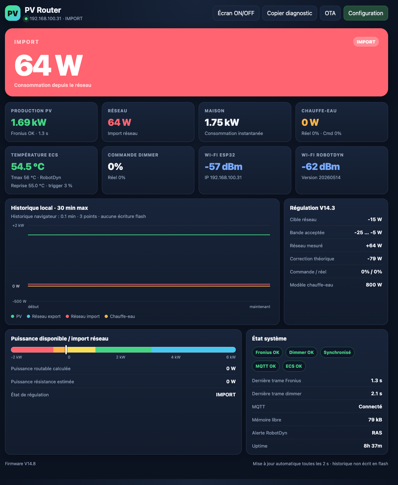
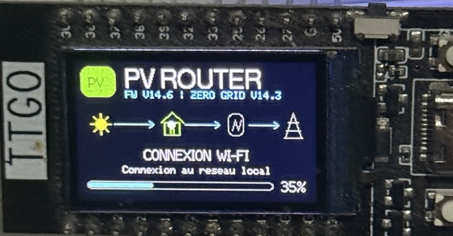
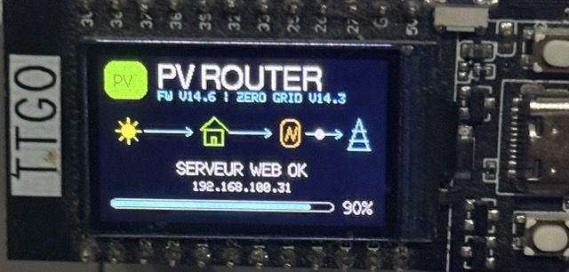
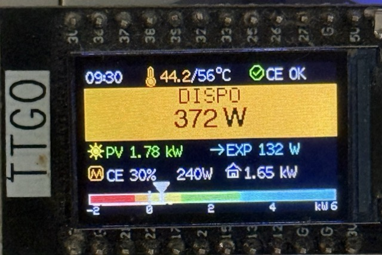
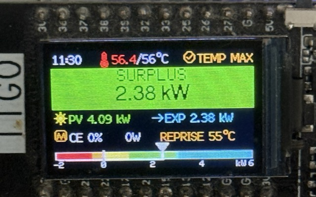
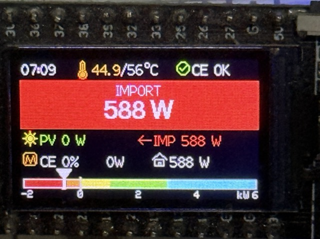
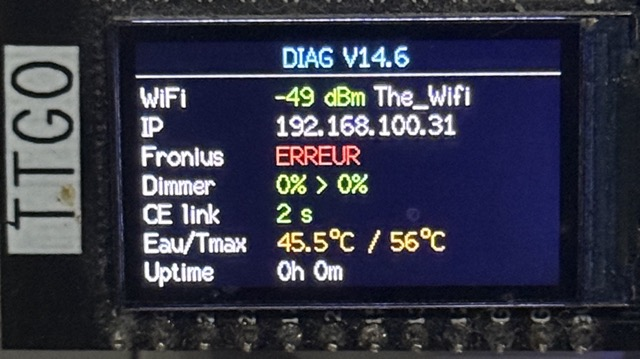
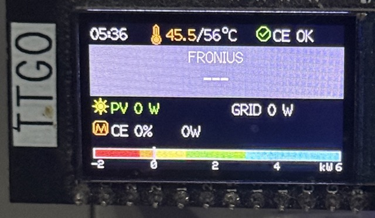
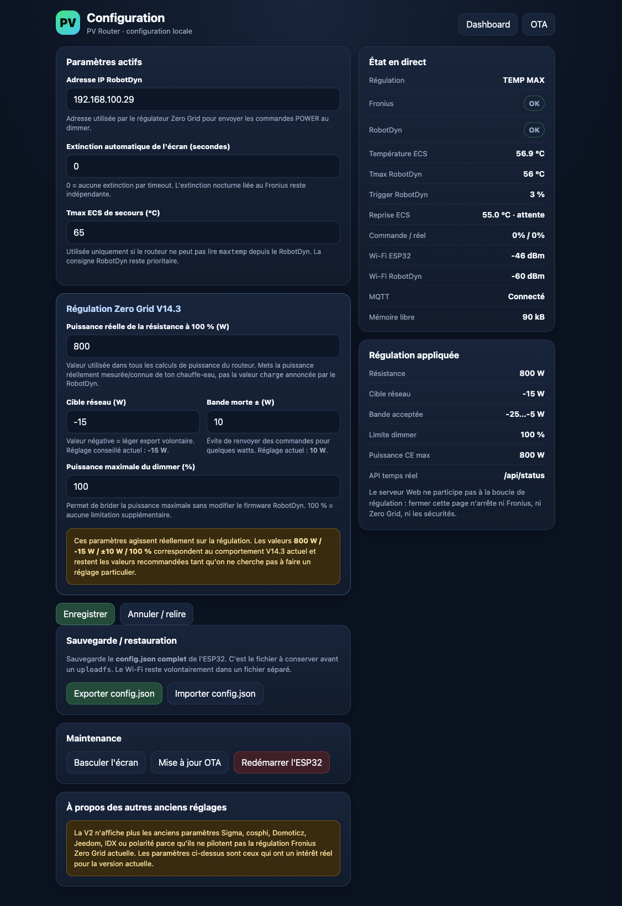
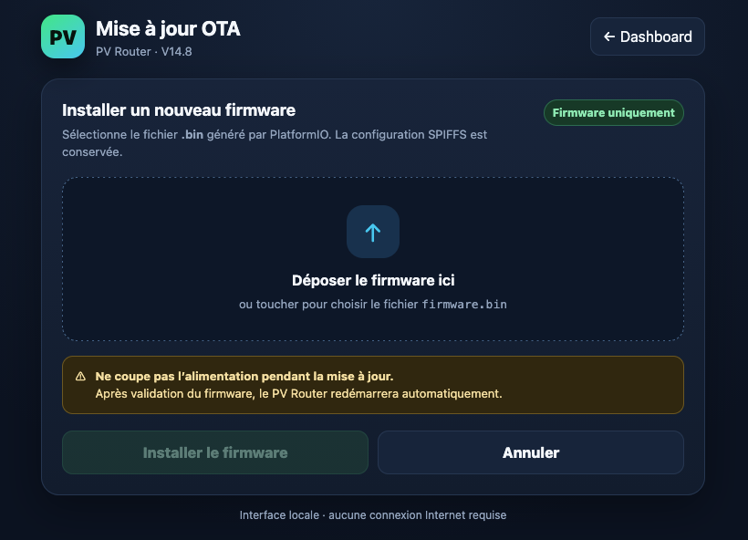

# PV Router ESP32 / TTGO T-Display — Fronius Zero Grid + RobotDyn

🇫🇷 **[Documentation française](./README.md)** | 🇬🇧 **English — this file**

Photovoltaic surplus router for **ESP32 / TTGO T-Display**, using real-time measurements from a **Fronius inverter + Smart Meter** and HTTP control of a **RobotDyn Wi-Fi dimmer** driving a resistive water-heater load.

The goal is to consume PV surplus locally while keeping grid exchange as close to zero as possible, with a deliberate slight export bias to reduce short grid imports during fast load or PV changes.

> **PV Router firmware: V14.8**  
> **Zero Grid control algorithm: V14.3**  
> **Fronius interface: Solar API v1**  
> **Fronius endpoint: `/solar_api/v1/GetPowerFlowRealtimeData.fcgi`**  
> **Tested RobotDyn dimmer firmware: `Version 20260514`**

<p align="center">
  
</p>
<p align="center"><em>V14.8 Web dashboard — PV production, grid exchange, water heater, DHW temperature and Zero Grid regulation.</em></p>

---

## Origin, credits and acknowledgements

This project is an **adaptation and evolution of the ESP32 PV Router by Xlyric**:

- upstream project: https://github.com/xlyric/pv-router-esp32
- upstream author / maintainer: **Xlyric**
- community associated with the original project: **APPER**

Many thanks to **Xlyric** for publishing and maintaining this work as open source, and to the APPER community contributors. This repository would not exist in its current form without that foundation.

The Wi-Fi dimmer used by this branch is also based on the same author's project:

- **PV-discharge-Dimmer-AC-Dimmer-KIT-Robotdyn**: https://github.com/xlyric/PV-discharge-Dimmer-AC-Dimmer-KIT-Robotdyn

The hardware used here is a **RobotDyn / D1 mini** controlled over HTTP. The RobotDyn firmware validated with this branch is `Version 20260514`.

This adaptation intentionally differs from the original PV Router in several major areas: the **Fronius Smart Meter read through Fronius Solar API v1 is the regulation source of truth**, the active loop no longer uses SCT013 as its primary measurement source, the Zero Grid controller is predictive, and the Web UI / TTGO display have been extensively redesigned.

> This repository is a personal adaptation of the upstream project and should not be presented as an official release from Xlyric or the APPER association.

---

# 1. Architecture

```text
                         230 V grid
                              ^
                              |
Fronius + Smart Meter         |
        |                     |
        | Solar API v1        |
        | HTTP / PowerFlow    |
        v                     |
     ESP32 / TTGO             |
        |                     |
        | Zero Grid V14.3     |
        | HTTP POWER=0..100   |
        v                     |
 RobotDyn Wi-Fi Dimmer -------+
        |
        v
 water heater / resistor
```

The **regulation loop does not depend on MQTT or Home Assistant**. The critical path is only:

```text
Fronius -> ESP32 -> RobotDyn
```

MQTT, Home Assistant, the Web dashboard and the TTGO screen are telemetry / user-interface layers.

---

# 2. Reference hardware

Tested setup:

- ESP32 **TTGO T-Display**, 240 × 135, ST7789;
- **Fronius Primo 6.0-1** inverter;
- **Fronius Smart Meter TS 65A-1**;
- **RobotDyn / D1 mini** Wi-Fi dimmer;
- tested RobotDyn firmware: `Version 20260514`;
- BTA16 triac in the current reference dimmer hardware;
- Dallas / DS18B20 probe on the RobotDyn side for DHW temperature;
- resistive water-heater load calibrated in the PV Router to **800 W**;
- optional MQTT / Home Assistant telemetry.

The repository still contains some legacy local CT-measurement code, but this branch is designed and maintained around **Fronius Solar API v1 measurement**.

---

# 3. Fronius: Zero Grid source of truth

The firmware directly queries:

```text
GET http://<IP_FRONIUS>/solar_api/v1/GetPowerFlowRealtimeData.fcgi
```

A sample is accepted only when HTTP returns 200, the JSON is valid, `Head.Status.Code == 0`, `Body.Data.Site.P_Grid` exists, and `P_Grid` is finite and within a plausible range.

PV production is read from `Body.Data.Site.P_PV`, with a fallback to `Body.Data.Inverters.1.P`.

### Sign convention

```text
P_Grid > 0  = grid import
P_Grid < 0  = grid export
```

### Adaptive Fronius polling — V14.7+

Normal daytime regulation remains fast. When Fronius stays unavailable for a long time, typically overnight, HTTP requests are slowed down to reduce TTGO CPU / Wi-Fi activity:

```text
Fronius ONLINE             : 1.5 s
OFFLINE for < 2 min        : 5 s
OFFLINE for 2 to 10 min    : 15 s
OFFLINE for > 10 min       : 30 s
HTTP timeout               : 700 ms
Regulation stale threshold : 4 s
```

As soon as a valid Fronius response comes back, the normal **1.5 s** cadence is restored immediately.

---

# 4. Zero Grid regulation V14.3

Default settings:

```text
Heater resistance power : 800 W
Maximum dimmer           : 100 %
Grid target              : -15 W
Deadband                 : ±10 W
Effective target band    : -25 W to -5 W
```

These values are stored in `config.json` and can be changed from Web V2.

Physical control principle:

```text
Pheater_target = Pheater_current + (Pgrid_target - Pgrid_current)
```

V14.3 no longer relies on arbitrary upward ramps. Downward power changes remain unrestricted so a newly started household load can shed the heater quickly.

Current internal thresholds:

```text
Fast import threshold      : 80 W
Emergency import threshold : 250 W
Fast reserve               : 25 W
Emergency reserve          : 50 W
```

---

# 5. RobotDyn

## Power command

```text
GET http://<IP_DIMMER>/?POWER=<0..100>
```

With an 800 W calibrated heater:

```text
1 %   ~= 8 W
50 %  ~= 400 W
100 % ~= 800 W
```

## State and temperature

```text
GET http://<IP_DIMMER>/state
GET http://<IP_DIMMER>/config
```

Normal timing:

```text
/state unsynchronised : ~2 s
/state synchronised   : ~5 s
/config               : 30 s
HTTP timeout          : 500 ms
Command keepalive     : 60 s
```

After **10 minutes of Fronius being offline**, RobotDyn eco polling is enabled:

```text
/state  : 30 s
/config : 5 min
```

Until `/config` has been successfully read at least once, the 10 s retry is kept for thermal-safety reasons.

## Tmax and trigger

The tested RobotDyn firmware uses integer arithmetic:

```text
release = maxtemp - ((maxtemp * trigger) / 100)
```

Example:

```text
maxtemp = 56 °C
trigger = 3 %
(56 * 3) / 100 = 1
release = 55 °C
```

The PV Router mirrors that exact formula. Once `TEMP MAX` is reached, heating remains inhibited (`TEMP HOLD`) until the release temperature is reached.

---

# 6. Safety / fail-safe

The PV Router requests `POWER=0` when Fronius is unreachable or stale, `autonome=false`, RobotDyn reports `onoff=false`, a non-temperature RobotDyn alarm is active, or local DHW thermal protection is active.

MQTT and Home Assistant are not part of this safety chain.

---

# 7. First Wi-Fi setup

Wi-Fi setup is **physically triggered** and is never exposed only because the home router is unavailable.

1. power the PV Router off;
2. hold the TTGO user button (`GPIO35`);
3. power back on while holding the button;
4. keep holding for about **3 seconds**;
5. release when `MODE CONFIG WIFI` appears.

Join:

```text
SSID     : PVRouter-Setup
Password : pvrouter14
Address  : http://192.168.4.1
```

After **Save and restart**, credentials are stored in `/wifi.json` and the ESP32 reboots.

Credential priority:

```text
1. /wifi.json when a real SSID is stored
2. WIFI_NETWORK / WIFI_PASSWORD from config.h as fallback
```

### Graphical boot

| Wi-Fi connection | Web server ready |
| --- | --- |
|  |  |

Dedicated guides:

- [Première configuration Wi-Fi — français](./docs/WIFI_SETUP_FR.md)
- [First Wi-Fi setup — English](./docs/WIFI_SETUP_EN.md)

---

# 8. TTGO display

The main screen shows time, DHW temperature/Tmax, heater state, the large `IMPORT` / `ZERO GRID` / `DISPO` / `SURPLUS` banner, PV, grid, heater, house and the power gauge.

Normal button behavior:

```text
Short press : main -> diagnostics -> help -> main
Long press  : screen OFF
```

### Main router states

| Energy available | Surplus | Grid import |
| --- | --- | --- |
|  |  |  |

### Diagnostics and Fronius outage

| Diagnostics | Fronius unavailable |
| --- | --- |
|  |  |

The diagnostics page shows Wi-Fi RSSI and SSID, IP, Fronius, Dimmer, CE link, DHW/Tmax and uptime. The SSID uses the same font/size as the Wi-Fi line and is cached to avoid intermittent disappearance during redraws.

After about 10 minutes of Fronius remaining offline, the TFT backlight is automatically switched off. A button press can still temporarily wake the screen.

---

# 9. Web V2

Dashboard:

```text
http://<ROUTER_IP>/
```

Configuration:

```text
http://<ROUTER_IP>/config.html
```

The dashboard includes PV / grid / house / heater, Fronius / RobotDyn / MQTT states, DHW temperature / Tmax / trigger / release, Zero Grid diagnostics, about 30 minutes of browser-side history, copyable diagnostics, free heap, uptime and TTGO screen help.

### Web preview

| Real-time dashboard | Diagnostics / details |
| --- | --- |
|  |  |

Local API:

```text
GET  /api/status
GET  /api/config
POST /api/config
GET  /api/config/export
POST /api/config/import
POST /api/screen/toggle
POST /api/restart
```

`/api/status` exposes:

```text
firmware_version       = V14.8
fronius_api            = Solar API v1
fronius_powerflow_path = /solar_api/v1/GetPowerFlowRealtimeData.fcgi
regulation.version     = V14.3
```

### Web icon / favicon — V14.8

V14.8 adds embedded PV Router branding at:

```text
/favicon.svg
/favicon.ico
```

The favicon is part of the firmware, so no `uploadfs` is required. Browsers cache favicons aggressively, so a hard refresh or reopening the tab may be needed after upgrading.

---

# 10. MQTT / Home Assistant

Main topic:

```text
pvrouter/state
```

Availability:

```text
pvrouter/availability
```

The Zero Grid loop does not depend on MQTT. Home Assistant Discovery is available when `HA_ENABLED` is enabled.

---

# 11. Installation / HOW TO

## Clone the repository

```bash
git clone <REPOSITORY_URL>
cd pv-router-esp32-v2025
git checkout main
```

The project uses **PlatformIO**.

## Create `src/config/config.h`

```bash
cp src/config/config.example.h src/config/config.h
```

Configure at least:

```cpp
#define WIFI_NETWORK "FALLBACK_WIFI"
#define WIFI_PASSWORD "FALLBACK_PASSWORD"
#define IP_FRONIUS "192.168.x.x"
#define MQTT_SERVER "192.168.x.x"
#define MQTT_PORT 1883
#define MQTT_USER "my_user"
#define MQTT_PASSWORD "my_password"
```

Compile-time Wi-Fi credentials are **fallback values**: a valid stored `/wifi.json` takes priority.

## Prepare SPIFFS

For a full first installation:

```bash
cp data/config.json.ori data/config.json
cp data/wifi.json.ori data/wifi.json
```

Recommended first-flash `config.json` baseline:

```json
{
  "autonome": false,
  "dimmer": "192.168.x.x",
  "tmax": 65,
  "screentime": 0,
  "heater_power_w": 800,
  "grid_target_w": -15,
  "grid_deadband_w": 10,
  "dimmer_max_percent": 100
}
```

Set `autonome=true` only after Fronius and RobotDyn communication have been validated.

## Build and flash

```bash
pio run
pio run -t upload
pio device monitor -b 115200
```

To upload SPIFFS Web assets:

```bash
pio run -t uploadfs
```

### Important: `uploadfs`

`uploadfs` replaces the SPIFFS filesystem and can overwrite both `config.json` **and `wifi.json`**.

Before a new `uploadfs`:

```bash
curl --connect-timeout 5 http://<ROUTER_IP>/api/config/export -o data/config.json
pio run -t uploadfs
rm data/config.json
```

For Wi-Fi, either preserve `/wifi.json` or simply run the physical setup portal again afterwards.

> The V14.8 OTA page and favicon are embedded in **firmware** and do not require `uploadfs`.

---

# 12. Web OTA update — V14.8

Open:

```text
http://<ROUTER_IP>/update
```

<p align="center">
  
</p>
<p align="center"><em>V14.8 OTA interface — firmware selection, upload progress and automatic reboot after success.</em></p>

The V14.8 OTA interface provides:

- Web V2 matching design;
- drag-and-drop or selection of `firmware.bin`;
- file name and size;
- upload progress and percentage;
- firmware validation;
- clear error reporting;
- **automatic reboot after a successful update**;
- automatic polling for the router to come back online;
- automatic return to the dashboard afterwards.

The expected file is generally:

```text
.pio/build/<ENV>/firmware.bin
```

A firmware OTA update **does not replace SPIFFS**, so `config.json`, `wifi.json` and SPIFFS Web files are preserved.

**No authentication is currently applied to `/update`.** Treat this route as reachable by devices with LAN access.

---

# 13. Post-flash / post-OTA checks

Expected logs:

```text
WiFi connected
IP address:
192.168.x.x
Loading configuration...
start Web server
[FRONIUS] ONLINE PV=... W GRID=... W
[DIMMER] CONFIG OK MAX=... C TRIGGER=...% RELEASE=... C
[DIMMER] LINK OK ACTUAL=...% CMD=...% TEMP=... C ...
```

During a prolonged Fronius outage you may see:

```text
[FRONIUS] Poll interval -> 5000 ms
[FRONIUS] Poll interval -> 15000 ms
[FRONIUS] Poll interval -> 30000 ms
[DIMMER] Eco polling ON
```

---

# 14. Quick diagnostics

### `FRONIUS OFFLINE`

Check `IP_FRONIUS`, LAN connectivity, Solar API v1, `P_Grid` and `Head.Status.Code`.

### `DIMMER OFFLINE`

Check `http://<IP_DIMMER>/state` and the RobotDyn address configured in Web V2 / `config.json`.

### `TEMP MAX` / `TEMP HOLD`

- `TEMP MAX`: Tmax reached;
- `TEMP HOLD`: waiting for the release threshold;
- `REPRISE xx°C`: calculated restart temperature.

### Wi-Fi lost

The firmware retries in the background. To deliberately change networks, reboot while holding GPIO35 for about 3 seconds.

---

# 15. Main files

```text
src/main.cpp
    boot, physical Wi-Fi setup and FreeRTOS tasks

src/config/version.h
    firmware / Zero Grid / Fronius API versions

src/functions/wifiSetupPortal.h
    PVRouter-Setup AP, captive portal and wifi.json save

src/tasks/wifi-connection.h
    Wi-Fi connection/reconnection and wifi.json priority

src/tasks/measure-electricity.h
    Fronius acquisition + adaptive polling

src/functions/froniusZeroGrid.h
    Zero Grid V14.3 controller and RobotDyn commands

src/tasks/gettemp.h
    RobotDyn /state + /config, Dallas, Tmax, trigger and eco polling

src/tasks/smoothDisplay.h
    differential TTGO renderer

src/tasks/versionedDisplay.h
    display scheduler, diagnostics and Wi-Fi SSID

src/tasks/displayHelp.h
    third on-device help page

src/tasks/bootScreen.h
    graphical vector boot screen

src/functions/webFunctions.h
    Web V2 and local API

src/functions/webOta.h
    V14.8 OTA page, firmware upload, validation, auto reboot and favicon

src/functions/Mqtt_http_Functions.h
    MQTT and Home Assistant Discovery

src/functions/spiffsFunctions.h
    config.json and wifi.json

data/index.html
    Web V2 dashboard

data/config.html
    Web V2 configuration
```

---

# 16. Versions

## V14.8 — current firmware

V14.8 adds:

- redesigned integrated OTA page;
- `.bin` upload with progress;
- validation and **automatic reboot after success**;
- automatic return to the dashboard after reboot;
- embedded PV Router favicon / Web identity.

## V14.7

V14.7 adds the **network eco mode**: adaptive Fronius polling from 1.5 s to 30 s while the inverter stays offline, plus slower RobotDyn polling after 10 minutes of Fronius unavailability.

## V14.6

V14.6 introduced **physical Wi-Fi provisioning at boot** with a 3-second button hold, `PVRouter-Setup`, captive portal at `192.168.4.1`, `wifi.json` persistence and non-blocking boot.

```text
PV Router firmware       : V14.8
Zero Grid algorithm      : V14.3
Fronius interface        : Solar API v1
Tested RobotDyn firmware : Version 20260514
```

This separation is intentional: Web UI, display or installation improvements can change the PV Router firmware version without changing the Zero Grid algorithm or the Fronius API generation.
